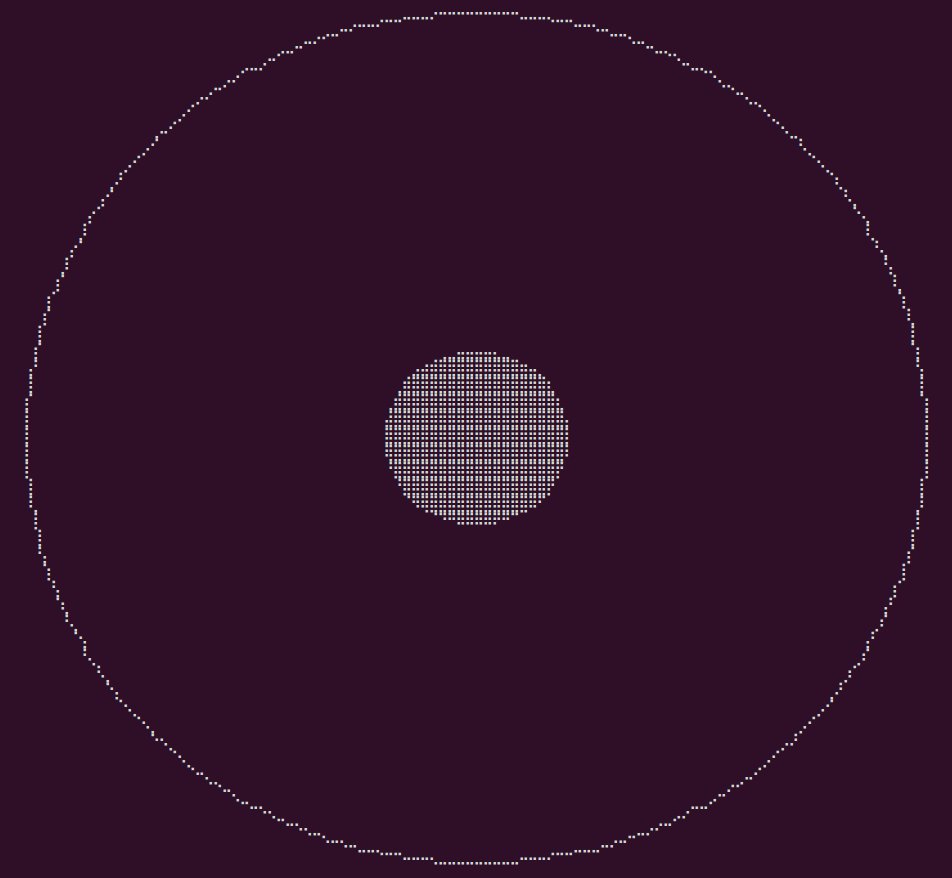

# terminal-joystick

:video_game: A joystick for your terminal.



:warning: Highly experimental

## Install

```
npm i -S terminal-joystick
```

## Usage

```javascript
const { TerminalJoystick, ON_DRAG } = require('../lib');

const joystick = new TerminalJoystick({
  title : 'Joystick - Example',
});

joystick.on(ON_DRAG, ({ angle, intensity }) => {
  // Do stuff...
});

joystick.on(ON_DRAG_END, ({ angle, intensity }) => {
  // Do stuff...
});
```

## Using with blessed

To add ```terminal-joystick``` to an existing blessed application, you just need to provide a reference to the ```blessed.screen``` object and a ```parent``` container :

```javascript
const { TerminalJoystick, ON_DRAG } = require('../lib');

const screen = blessed.screen();
const container = new blessed.Box({
  left : 'center',
  top  : 'center',
  width : '100%',
  height : '100%',
});

const joystick = new TerminalJoystick({
  parent : container,
  title : 'Joystick - Example',
  screen,
});

joystick.on(ON_DRAG, ({ angle, intensity }) => {
  // Do stuff...
});
```

## API

- ```new TerminalJoystick(opts)```
  - ```screen``` : reference to an existing ```blessed``` screen (optional)
  - ```container``` :
    - ```size``` : pad's size (default : 100)
    - All ```blessed.Element``` [properties](https://github.com/chjj/blessed#element-from-node)
  - ```joystick``` :
    - ```size``` : joystick's size (default : 15)
    - All ```blessed.Element``` [properties](https://github.com/chjj/blessed#element-from-node)
  - ```title``` : terminal tab title (optional) / Only used if ```screen``` is not provided
  - ```noReturnToOrigin``` : A flag to disable the joystick return to its initial position when mouse click is released.
- ```on(event, handler)``` : ```TerminalJoystick``` extends ```EventEmitter```.
  - ```ON_DRAG``` : emitted when the joystick is dragged.
    - ```angle``` : angle in degress (0-360) between the joystick and the x-axis.
    - ```intensity``` : distance from the center (0-1)
    - ```x``` : coordinate along the x-axis between -1 and 1
    - ```y``` : coordinate along the y-axis between -1 and 1
  - ```ON_DRAG_END``` : emitted when the mouse click is released.
